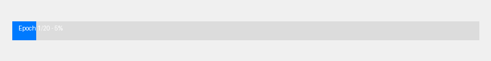

# GMM-VAE: Gaussian Mixture Model Variational Autoencoder

This project implements a powerful Variational Autoencoder (VAE) with Gaussian Mixture as a prior distribution, enabling both unsupervised clustering and high-quality image generation. The model is specifically optimized for handling custom high-resolution images while preserving their original details.

## Overview

Contrary to classical VAE models, this model assumes that observed data (inputs) is generated from a mixture of K normal distributions, where K represents the number of clusters. This approach enables both powerful clustering and high-quality image reconstruction capabilities.

## Key Features

- **High-Resolution Image Support**: Processes custom high-resolution images without forced downsampling
- **Unsupervised Clustering**: Automatically discovers latent patterns in image data
- **Quality Reconstructions**: Generates high-fidelity reconstructions of input images
- **Organized Visualization**: Saves reconstructed images in dedicated, well-organized folders
- **Apple Silicon Optimization**: Enhanced performance on Apple M-series chips via MPS backend
- **Dynamic Model Sizing**: Now supports any input image size across all datasets (MNIST, CIFAR-10, custom)
- **KL Annealing**: Gradual introduction of the KL term for better convergence
- **Gradient Clipping**: Prevents exploding gradients for more stable training

## Training Progress



*Reconstruction quality improves throughout training epochs as the model learns to capture patterns*

## Applications

This GMM-VAE model is ideal for:

- **Image Generation and Reconstruction**: Create high-quality reconstructions of custom images
- **Automatic Labeling**: Cluster and label unlabeled image data
- **Dataset Augmentation**: Generate "plausible" variations for unbalanced datasets
- **Anomaly Detection**: Identify outliers in image collections
- **Latent Space Exploration**: Visualize and manipulate images in latent space

## Quick Start

The project now includes several convenient scripts for different training scenarios:

```bash
# Clean previous results and train with MPS optimization
./clean_and_train.sh

# Train on CIFAR-10 dataset
./run_cifar10.sh

# Train on custom images with MPS optimization
./run_mps_optimized.sh
```

## Using with Custom Images

The model is specifically enhanced to work with your own high-resolution photos:

1. **Training**: Use one of the provided scripts to train on your image collection:
   ```bash
   ./run_singlegpu.sh    # For single GPU training (recommended)
   ./run_training.sh     # For standard training with larger batch size
   ```

2. **Reconstruction Visualization**: During training, the model automatically saves reconstructed images in organized folders:
   ```
   results/gmvae_custom_K10/reconstructions/
   ├── standard/             # Traditional reconstruction grids
   ├── comparisons/          # Side-by-side original vs. reconstructed pairs
   ├── large_comparisons/    # Detailed comparison grids with more examples
   └── clusters/             # Latent space clustering visualizations
   ```

3. **Model Customization**: Adjust parameters via script arguments:
   - `--K`: Number of clusters (default: 10)
   - `--batch-size`: Adjust based on image resolution and memory
   - `--x-size` and `--w-size`: Control latent representation dimensionality
   - `--kl-weight`: Weight for KL divergence term (default: 1.0)
   - `--recon-weight`: Weight for reconstruction loss (default: 1.0)
   - `--kl-anneal`: Enable KL annealing for first 10 epochs
   - `--clip-grad`: Gradient clipping value (default: 1.0)

## Technical Details

The implementation is based on the paper: "Deep Unsupervised Clustering with Gaussian Mixture Variational Autoencoders" by Nat Dilokthanakul, Pedro A. M. Mediano, Marta Garnelo, Matthew C. H. Lee, Hugh Salimbeni, Kai Arulkumaran, and Murray Shanahan. ([arXiv:1611.02648](https://arxiv.org/abs/1611.02648))

The model architecture consists of:
- **Encoder**: Transforms images into latent representations
- **Gaussian Mixture Prior**: Models the latent space as a mixture of K Gaussians
- **Decoder**: Reconstructs images from the latent representation

## Requirements

- PyTorch 1.9+
- Python 3.7+
- Apple Silicon GPU (for MPS acceleration) or NVIDIA GPU (for CUDA acceleration)
- Other dependencies listed in `requirements.txt`

## Citation

If you use this code in your research, please cite:

```
@article{dilokthanakul2016deep,
  title={Deep Unsupervised Clustering with Gaussian Mixture Variational Autoencoders},
  author={Dilokthanakul, Nat and Mediano, Pedro A. M. and Garnelo, Marta and Lee, Matthew C. H. and Salimbeni, Hugh and Arulkumaran, Kai and Shanahan, Murray},
  journal={arXiv preprint arXiv:1611.02648},
  year={2016}
}
```


