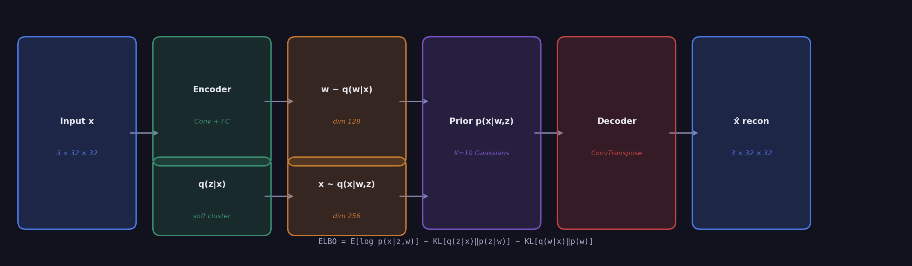
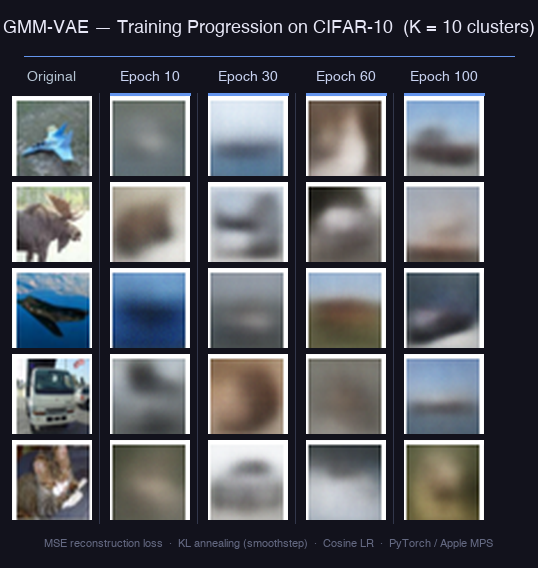
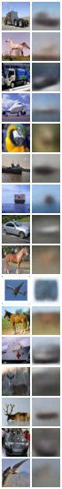
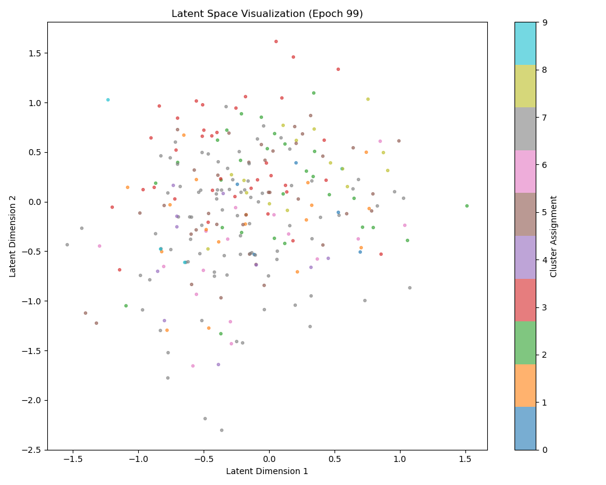
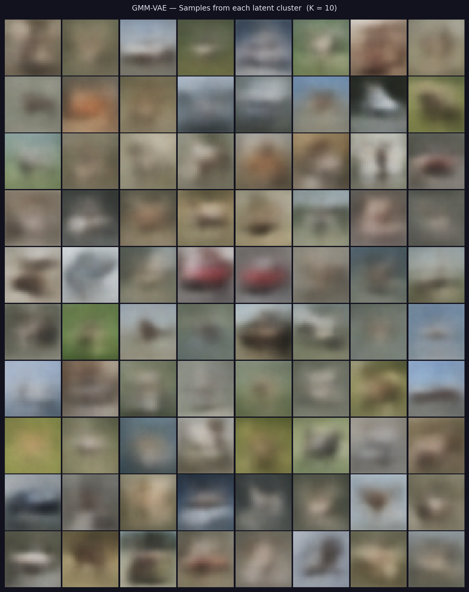

# GMM-VAE — Gaussian Mixture Variational Autoencoder

> Unsupervised clustering and image reconstruction using a GMM prior in the latent space.
> Trained on CIFAR-10 (K = 10 clusters, 100 epochs) with Apple MPS / CUDA / CPU support.

---

## Architecture



The model extends the standard VAE by replacing the isotropic Gaussian prior with a **mixture of K Gaussians**. The encoder produces:
- **q(z|x)** — soft cluster assignment over K components
- **q(w|x)** — a style/content embedding (dim 128)
- **q(x|w, z)** — the latent code (dim 256) conditioned on both

The **prior network p(x|w, z)** learns K cluster-specific Gaussian parameters from `w`, and the **decoder** reconstructs the image from `x`.

**ELBO objective:**

```
L = E[log p(x|z,w)]  −  KL[q(z|x) ‖ p(z|w)]  −  KL[q(w|x) ‖ p(w)]
```

---

## Results on CIFAR-10

### Training progression  (Original → Epoch 10 → 30 → 60 → 100)



Reconstruction quality improves steadily as KL annealing gradually enables the model to leverage the full capacity of the mixture prior.

### Final reconstruction quality  (Epoch 100)



Each row shows an original CIFAR-10 image (left) alongside its reconstruction (right).
The model preserves dominant colors and rough shapes after 100 epochs of MSE training.

<br clear="right"/>

### Latent space — cluster assignments



2-D PCA projection of the latent codes `x`, coloured by the argmax of `q(z|x)`.
Ten distinct clusters emerge without any class labels.

### Samples drawn from each cluster



8 samples generated from each of the 10 learned cluster priors.
Different clusters specialise in different textures, palettes, and object types.

---

## Quick start

### Install

```bash
pip install -r requirements.txt
```

### Train on CIFAR-10 (Apple MPS)

```bash
./run_cifar10.sh
```

### Train with custom arguments

```bash
python train_gmvae.py \
    --dataset cifar10 \
    --device mps \           # or cuda / cpu
    --epochs 100 \
    --K 10 \
    --x-size 256 \
    --w-size 128 \
    --hidden-size 512 \
    --kl-anneal \
    --kl-anneal-epochs 30 \
    --lr-scheduler
```

### Generate samples from a trained model

```bash
python sample_gmvae.py \
    --model-path models/gmvae_cifar10_K10_final.pt \
    --input-channels 3 \
    --K 10 \
    --output-dir samples/
```

This produces:
- `cluster_N_samples.png` — random samples from each cluster
- `cluster_morph.gif` — smooth SLERP interpolation between cluster centres
- `latent_walk.gif` — random walk through the latent space

### Create a training-progression GIF

```bash
python create_reconstruction_gif.py \
    --model cifar10 --k 10 \
    --type large_comparisons \
    --crossfade 8
```

---

## Key parameters

| Argument | Default | Description |
|---|---|---|
| `--K` | 10 | Number of mixture components |
| `--x-size` | 256 | Dimension of latent code **x** |
| `--w-size` | 128 | Dimension of style embedding **w** |
| `--hidden-size` | 512 | Encoder / prior FC width |
| `--kl-weight` | 0.1 | Weight on the KL terms |
| `--kl-anneal` | off | Smoothstep KL annealing |
| `--kl-anneal-epochs` | 30 | Ramp-up duration |
| `--recon-weight` | 10.0 | Weight on the MSE reconstruction loss |
| `--lr-scheduler` | off | Cosine LR decay (η_min = 5 % of η_0) |
| `--clip-grad` | 0.5 | Gradient clipping norm |

---

## Repository structure

```
GMM-VAE/
├── GM_VAE.py                    # Model: Encoder, PriorNetwork, Decoder, GMVAE
├── train_gmvae.py               # Training loop with TensorBoard logging
├── sample_gmvae.py              # Sampling, SLERP morph & latent walk GIFs
├── dataloader.py                # Dataset loaders (CIFAR-10, MNIST, custom)
├── create_reconstruction_gif.py # Build GIF from saved epoch snapshots
├── run_cifar10.sh               # One-line CIFAR-10 training (MPS optimised)
├── requirements.txt
├── docs/                        # Images used in this README
└── results/                     # Saved reconstructions and cluster plots
    └── gmvae_cifar10_K10/
        └── reconstructions/
            ├── standard/
            ├── comparisons/
            ├── large_comparisons/
            └── clusters/
```

---

## Reference

> Dilokthanakul et al., *Deep Unsupervised Clustering with Gaussian Mixture Variational Autoencoders*, arXiv:1611.02648, 2016.

```bibtex
@article{dilokthanakul2016deep,
  title   = {Deep Unsupervised Clustering with Gaussian Mixture Variational Autoencoders},
  author  = {Dilokthanakul, Nat and Mediano, Pedro A. M. and Garnelo, Marta and
             Lee, Matthew C. H. and Salimbeni, Hugh and Arulkumaran, Kai and Shanahan, Murray},
  journal = {arXiv preprint arXiv:1611.02648},
  year    = {2016}
}
```
