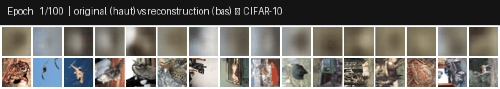
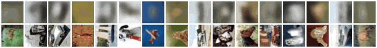
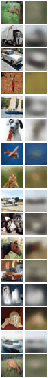

# GMM-VAE — Gaussian Mixture Variational Autoencoder

> Deep generative model for **unsupervised clustering and image reconstruction** using a Gaussian Mixture prior in the latent space.  
> Trained on CIFAR-10 · K = 10 clusters · Apple MPS / CUDA / CPU

---

<p align="center">
  
</p>
<p align="center"><em>Original images (top row) vs reconstructions (bottom row) — CIFAR-10, epochs 1 → 100</em></p>

---

## Overview

Standard VAEs place an isotropic Gaussian prior N(0, I) on the latent space, which conflates the *what* and *where* of a scene into a single unimodal distribution. This makes unsupervised clustering either impossible or a downstream afterthought.

**GMM-VAE** replaces that prior with a **Gaussian Mixture Model** whose parameters are *learned* rather than fixed. The model jointly optimises image reconstruction and latent-space clustering end-to-end, with no labels:

- The encoder infers a **soft cluster assignment** q(z|x) and a **content code** q(x|z,w).
- A **prior network** conditions the cluster-specific Gaussians on a global style embedding w, allowing each cluster to have a context-dependent, data-driven prior.
- The decoder maps the content code back to pixel space through a fully convolutional upsampling path.

This is an implementation of [Dilokthanakul et al., 2016](https://arxiv.org/abs/1611.02648) with several architectural and training upgrades described below.

---

## Probabilistic Model

### Generative process

```
w  ~  N(0, I)                          global style / content
z  ~  Cat(1/K, ..., 1/K)               cluster index
x  ~  N(μ_θ(w, z),  σ²_θ(w, z))       latent content code, prior-net conditioned
y  ~  p_θ(y | x)                       image decoder
```

### Inference (encoder)

```
q(w | y)   =  N(μ_φ^w(y),  σ²_φ^w(y))
q(z | y)   =  Cat(π_φ(y))             soft assignment via softmax
q(x | y)   =  N(μ_φ^x(y),  σ²_φ^x(y))
```

### ELBO objective

The evidence lower bound decomposes into four interpretable terms:

```
L(θ,φ; y)  =  E_q [ log p_θ(y | x) ]          reconstruction
             − KL [ q(w | y)  ‖  p(w) ]         style regularisation
             − KL [ q(z | y)  ‖  p(z) ]         clustering entropy
             − E_q [ KL [ q(x | y)  ‖  p(x | z, w) ] ]   latent alignment
```

The last term enforces that the posterior content code stays within the cluster-conditioned prior — this is the key coupling between the clustering and reconstruction objectives.

---

## Architecture

<p align="center">
  
</p>

### Encoder

Convolutional feature pyramid (stride-2 downsampling, 3 or 5 stages depending on input resolution) followed by a 2-layer FC bottleneck. Each stage uses **GroupNorm + SiLU** activation — GroupNorm is preferred over BatchNorm because it is batch-size invariant and more stable during the high-variance early training phase.

A **ResBlock** (two 3×3 convolutions with a skip connection) is appended at the deepest feature map (4×4) to enrich spatial representations before projection to the latent heads.

The encoder outputs five distribution parameters in a single forward pass:

| Head | Shape | Role |
|---|---|---|
| `μ_x`, `log σ²_x` | `[B, x_dim]` | Content code posterior |
| `μ_w`, `log σ²_w` | `[B, w_dim]` | Style embedding posterior |
| `π` | `[B, K]` | Soft cluster assignment |

### Prior Network

A 2-layer MLP with **LayerNorm** maps the style sample `w` to K pairs of `(μ_k, log σ²_k)` in content-code space. This makes the prior *adaptive*: each cluster's Gaussian is not a fixed hyperparameter but a learned function of the global style context.

### Decoder

**Upsample (nearest-neighbour) + Conv2d** blocks instead of transposed convolutions.  
Transposed convolutions introduce periodic checkerboard artifacts due to uneven overlap — a well-documented failure mode in generative models ([Odena et al., 2016](https://distill.pub/2016/deconv-checkerboard/)). The Upsample+Conv combination avoids this entirely by decoupling resolution scaling from feature mixing.

Each upsampling stage is preceded by a **ResBlock** that refines features at the current resolution before doubling spatial size. The channel schedule follows a standard pyramid: 512 → 256 → 128 → 64 → 32 → C.

---

## Loss Function

### Reconstruction: MSE + SSIM blend

```python
L_recon = (1 − α) · MSE(ŷ, y) + α · (1 − SSIM(ŷ, y))
```

Pure MSE minimises pixel-wise L2 distance but is blind to structural correlations — it produces blurry reconstructions because blurring is a local minimum of per-pixel error. **SSIM** penalises differences in local luminance, contrast, and structure, which aligns better with human perceptual quality. A blend of both (`--ssim-weight 0.5`) combines the stable gradients of MSE with the structural sensitivity of SSIM.

The reconstruction loss is normalised by the number of pixels so that the scale is resolution-invariant and the KL/reconstruction trade-off remains consistent across image sizes.

### KL terms

All three KL divergences have closed-form Gaussian or Categorical solutions. The logvars are clamped to [−10, 4] to prevent numerical explosion from near-zero denominators in the KL alignment term.

**KL annealing** (smoothstep schedule over 50 epochs) prevents posterior collapse: without it, the model learns to ignore the latent code early in training (the KL term drops to zero while the encoder stops encoding), and the decoder degenerates to a mode-averaging blurry prior.

### Optional: Perceptual loss (VGG-16)

```python
L_perceptual = Σ_l MSE(VGG_l(ŷ),  VGG_l(y))
```

Feature-space MSE at relu1_2, relu2_2, relu3_3 of a frozen VGG-16. Activates semantic texture and edge information that neither MSE nor SSIM capture.

---

## Results

### Reconstruction evolution

<p align="center">
  
</p>
<p align="center"><em>Top: original · Bottom: reconstruction — quality improves as KL annealing completes</em></p>

### Side-by-side comparisons across epochs

<p align="center">
  
</p>

### Latent space — cluster structure

<p align="center">
  
</p>
<p align="center"><em>2D PCA of content codes x, coloured by argmax q(z|y). Ten clusters emerge without labels.</em></p>

### Samples from each cluster prior

<p align="center">
  
</p>
<p align="center"><em>8 samples drawn from each of the 10 cluster priors p(x|z=k, w). Clusters specialise in colour palettes, textures and object types.</em></p>

### Benchmark metrics (CIFAR-10, epoch 100)

| Metric | Value | Description |
|---|---|---|
| **MSE** | — | Mean squared pixel error |
| **PSNR** | — dB | Peak signal-to-noise ratio |
| **SSIM** | — | Structural similarity index [0, 1] |
| **LPIPS** | — | Learned perceptual similarity (AlexNet) |
| **FID** | — | Fréchet Inception Distance |

> Run `python benchmark.py` after training to populate this table (see [Benchmark](#benchmark)).

---

## Training

### Install

```bash
pip install -r requirements.txt
```

### CIFAR-10 — recommended configuration

```bash
python train_gmvae.py \
    --dataset cifar10 \
    --device mps \
    --batch-size 64 \
    --epochs 150 \
    --lr 3e-4 \
    --lr-scheduler \
    --kl-anneal --kl-anneal-epochs 50 \
    --recon-weight 10 \
    --ssim-weight 0.5 \
    --x-size 128 \
    --w-size 64 \
    --hidden-size 256 \
    --K 10 \
    --test-interval 5 \
    --patience 20
```

### Custom dataset

```bash
python train_gmvae.py \
    --dataset custom \
    --data-dir path/to/images \
    --target-width 64 --target-height 64 \
    --batch-size 16 \
    --epochs 150 \
    --kl-anneal --kl-anneal-epochs 50 \
    --recon-weight 10 \
    --ssim-weight 0.5 \
    --device mps
```

### Key hyperparameters

| Argument | Default | Role |
|---|---|---|
| `--K` | 10 | Number of mixture components |
| `--x-size` | 128 | Content code dimension |
| `--w-size` | 64 | Style embedding dimension |
| `--hidden-size` | 256 | Encoder / prior FC width |
| `--kl-weight` | 1.0 | Final KL scale factor |
| `--kl-anneal` | off | Smoothstep ramp-up (prevents posterior collapse) |
| `--kl-anneal-epochs` | 50 | Annealing duration |
| `--recon-weight` | 10 | Reconstruction loss scale |
| `--ssim-weight` | 0.0 | SSIM blend in reconstruction loss (0 = pure MSE) |
| `--perceptual` | off | Add VGG perceptual loss |
| `--perceptual-weight` | 1.0 | Perceptual loss scale |
| `--test-interval` | 1 | Evaluate every N epochs |
| `--patience` | 0 | Early stopping (0 = disabled) |
| `--lr-scheduler` | off | Cosine LR decay (η_min = 5% η_0) |
| `--clip-grad` | 1.0 | Gradient clipping norm |

---

## Benchmark

Compute MSE, PSNR, SSIM, LPIPS and FID on any checkpoint or set of checkpoints:

```bash
# Single checkpoint
python benchmark.py \
    --model models/gmvae_cifar10_K10_best.pt \
    --dataset cifar10 \
    --device mps \
    --K 10 --x-size 128 --w-size 64 --hidden-size 256 \
    --save-grid

# Compare multiple checkpoints (training curve)
python benchmark.py \
    --model models/gmvae_cifar10_K10_epoch_50.pt \
            models/gmvae_cifar10_K10_epoch_100.pt \
            models/gmvae_cifar10_K10_best.pt \
    --dataset cifar10 --device mps \
    --K 10 --x-size 128 --w-size 64 --hidden-size 256
```

Results are saved to `benchmark_results/benchmark.json` and `benchmark_results/benchmark.csv`.

---

## Sample generation

```bash
python sample_gmvae.py \
    --model-path models/gmvae_cifar10_K10_best.pt \
    --input-channels 3 \
    --K 10 \
    --output-dir samples/
```

Produces:
- `cluster_N_samples.png` — random samples from each cluster prior
- `cluster_morph.gif` — SLERP interpolation between cluster centres
- `latent_walk.gif` — stochastic walk through the content-code manifold

---

## Repository structure

```
GMM-VAE/
├── GM_VAE.py                    # ResBlock, Encoder, PriorNetwork, Decoder, GMVAE, GMVAELoss
├── train_gmvae.py               # Training loop — KL annealing, SSIM, early stopping, TensorBoard
├── benchmark.py                 # MSE / PSNR / SSIM / LPIPS / FID evaluation
├── sample_gmvae.py              # Unconditional sampling, SLERP morph, latent walk
├── dataloader.py                # CIFAR-10, MNIST, custom high-res dataset
├── create_reconstruction_gif.py # Assemble epoch snapshots into a GIF
├── requirements.txt
├── docs/                        # Static figures for this README
│   ├── architecture.png
│   ├── latent_space_clusters.png
│   ├── cluster_samples.png
│   └── reconstruction_epoch100.png
└── animations/                  # Training progression GIFs
    ├── reconstruction_training_v2.gif
    ├── cifar10_K10_large_comparisons.gif
    └── compact/
        └── cifar10_horizontal_flow.gif
```

---

## Reference

> Dilokthanakul, N., Mediano, P. A. M., Garnelo, M., Lee, M. C. H., Salimbeni, H., Arulkumaran, K., & Shanahan, M. (2016).  
> **Deep Unsupervised Clustering with Gaussian Mixture Variational Autoencoders.**  
> *arXiv:1611.02648*

```bibtex
@article{dilokthanakul2016deep,
  title   = {Deep Unsupervised Clustering with Gaussian Mixture Variational Autoencoders},
  author  = {Dilokthanakul, Nat and Mediano, Pedro A. M. and Garnelo, Marta and
             Lee, Matthew C. H. and Salimbeni, Hugh and Arulkumaran, Kai and Shanahan, Murray},
  journal = {arXiv preprint arXiv:1611.02648},
  year    = {2016}
}
```

> Odena, A., Dumoulin, V., & Olah, C. (2016).  
> **Deconvolution and Checkerboard Artifacts.**  
> *Distill.* https://distill.pub/2016/deconv-checkerboard/
